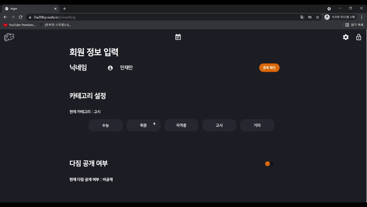
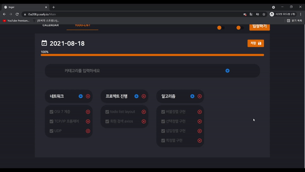
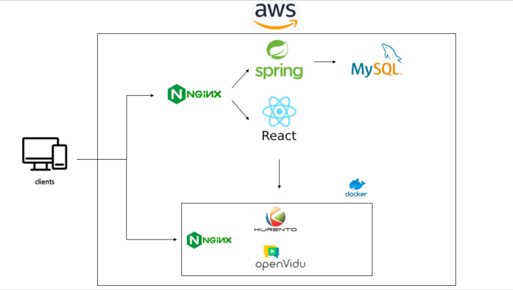
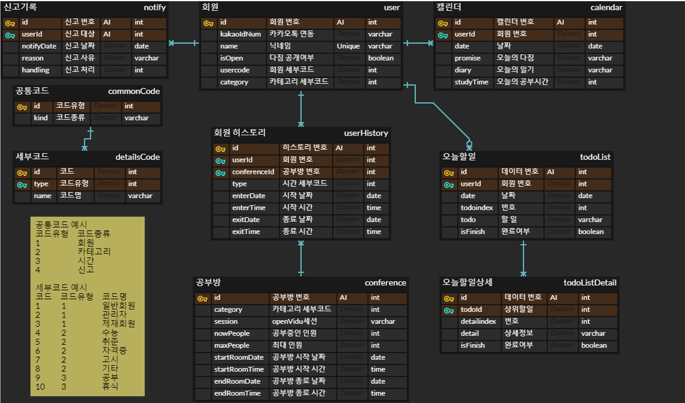

# :tropical_fish: 잉어(inger) - 온라인 웹 스터디

## :information_desk_person: 프로젝트 소개

**소개 영상**

[동영상 바로보기](https://www.youtube.com/watch?v=mnIhrmXxzAY)

**잉어**는 `webRTC 기술을 활용한 온라인 웹 스터디 서비스` 입니다.
**웹 스터디**는 `온라인 환경에서 자신이 공부하는 모습이나 내용을 공유`하는 서비스입니다.

 코로나19사태 이후 오프라인에서 다 같이 모여서 공부 할 수 없는 상황이 되며 자택 등 실내에서 혼자 공부를 해야 하는 경우가 이전보다 많아졌습니다. 

 이로 인해 코로나19사태 이후 웹 스터디 서비스 사용량이 눈에 띄게 증가하였습니다. 하지만 기존의 온라인 스터디는 ① 누군가 방 또는 그룹을 개설하면, ② 다른 이용자가 방을 선택하고 참여하는 방식이 주를 이루고 있습니다.

 잉어는 이러한 중간 과정을 `원터치로 가능하게끔 만들어` 공부에 좀 더 초점을 맞추고자 했습니다. 또한 `기록을 강조`하는 __다짐__, __투두리스트__, __일기__ 기능을 통해 `사용자의 마음가짐을 매순간 점검`할 수 있도록 돕고 있습니다. 마지막으로 같은 관심사를 가진 사람들끼리 해당 기록들을 `선택적으로 공유`하여 학습 의지도 높일 수 있습니다.

## :fish: 잉어?

잉어는 **~ing**와 **~er**을 이어 붙여 새롭게 만든 단어입니다. `무언가를 하고 있는 사람`이라는 뜻입니다.

목표로 하는 직업이 아닌 목표로 하는 **행위에 초점**을 맞추고자 하는 가치를 담고 있습니다. 이는 사용자들의 노력이 직업에 가려지는 것이 아닌 `매일매일 하고 있는 일이 의미있는 일`임을 상기 시키고자 탄생하였습니다.

## :question: 기능

### :one: 소셜 로그인

> 잉어를 사용하기 위해 `따로 계정을 생성할 필요가 없습니다.`
>  카카오톡 계정으로 간편하게 로그인 후 닉네임과 카테고리, 캘린더 공개 여부만 설정하면 잉어의 모든 서비스를 이용할 수 있습니다. 

### :two: 공부방

> 필요에 따라 방을 만들거나, 마음에 드는 방을 찾는 번거로움을 없앴습니다.
>
> 지정한 카테고리를 바탕으로, `클릭 한 번`이면 공부방에 입장 할 수 있습니다.
>
> 단, 자유롭게 공부하고 싶은 사람들이 모이는 상황까지 고려하여, 4가지의 카테고리에 자율까지 총 5가지 카테고리를 사용했습니다.
>
> 자율 카테고리는 공부방 내부에 사람이 적거나 없는 상황을 방지 할 수 있습니다.
>
> > 카테고리 종류 : 수능 취준 자격증 고시 기타) 

### :three: 캘린더

> 사용자의 하루 **다짐**과 __일기__, **Todo List**를 작성하여 본인의 계획을 기록 할 수 있습니다.
>
>  이 기록은 선택에 따라 같은 공부방에 있는 사람들끼리 `서로 열람할 수 있어` 관련된 공부를 하고 있는 사람들끼리 도움이 될 수 있습니다.
>
>  자율 카테고리에서는 다른 공부를 하고있더라도 다른 분야에서는 어떤 방식으로 학습하는지 알 수 있습니다.
>
> 기록과 공유를 통해 끊임없이 사용자의 `목표를 상기`시킬 수 있습니다. 또한 방 퇴장 시에도 하루의 다짐을 보여 주며, 사용자의 목표 달성을 장려하고자 합니다.

## :information_source: 프로젝트 명세

### 배포 환경

- **AWS EC2**
- **배포 여부** : inactive
- **HTTPS 적용** : O
- **PORT** : 443, 3000, 3306, 8080

### 개발 환경

#### Front-end

- **Framework** : React
- **지원 환경** : Web
- **담당자** : 김민재, 김하영, 전선규

#### Back-end

- **Framework** : Spring boot
- **Database** : MySQL
- **담당자** : 김영환, 이채하, 임완택

### 핵심 라이브러리

- Kakao API
  - **링크** : https://developers.kakao.com/docs/latest/ko/kakaologin/rest-api
  - **소개** : 카카오에서 제공하는 카카오 소셜 로그인 REST API
  - **사용 기능** : 카카오 소셜 로그인
  - **담당자** : 김민재, 이채하
- OpenVidu
  - **링크** : https://docs.openvidu.io/en/2.19.0/tutorials/openvidu-insecure-react/
  - **소개** : webRTC 오픈 소스
  - **사용 기능** : 공부방
  - **담당자** : 김영환, 전선규
  
  

## 🔆 System Architecture : 시스템 아키텍처

## :file_folder: 기술 스택

- **:art: Front-End**
  - Language
    -  
  
  - Framework / Library
    - 
  - Design
    -  
  - open API
    -  
  
- :computer:  __Back-End__

  - Language
    - 
  - Framework / Library
    - 

- :house_with_garden: __Common__

  - Co-work
    -   

## 💾 ERD

## 🖐 Installation

- [settings](./exec/settings.md) 문서 참조
